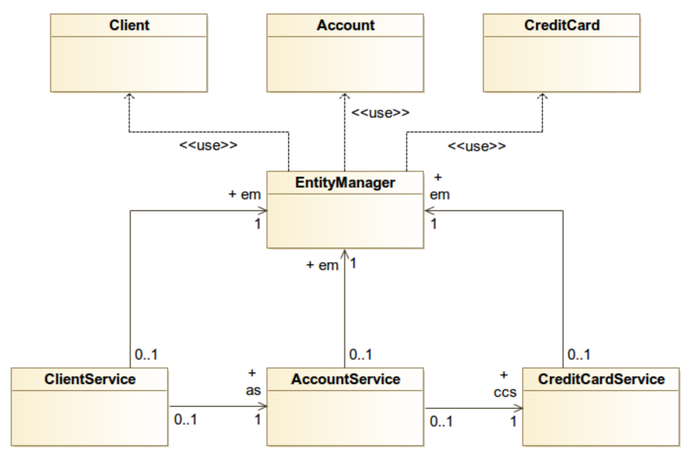

# CAES - Pràctica 1

## Objectiu

Partint d'un software ja existent, l'objectiu de la pràctica és que examineu el software, decidiu quins mètodes de 
quines classes s'ha de testejar, i dissenyeu i implementeu els tests. Aquest software **no el podeu modificar**, 
només podeu afegir tests.

## Material

Trobareu el codi d'aquest exercici al repositori. És un projecte Maven que pot ser obert directament amb qualsevol IDE.

## Entrega

Aquesta pràctica s'entregarà per Github. Heu de seguir aquestes instruccions **AL PEU
DE LA LLETRA** per què la pràctica es pugui tractar automatitzadament:

1. Fer un _fork_ d'aquest repositori al vostre compte personal de Github
2. Crear els tests unitaris al package **org.udg.caes.banking**, carpeta *src/test/java* del repositori
3. El codi que hi ha a *src/main/java* **NO ES POT TOCAR NI UNA SOLA LÍNIA**. S'ha de mantindre exactament igual que 
l'original. Només podeu afegir codi als tests, a *src/test/java*
4. Els tests estaràn subdividits per test cases (classes de test) de manera que cada testcase només contindrà tests 
d'un sol mètode. Per tant, us sortiran com a mínim tants testcases com mètodes poseu sota test. Per exemple, si decidiu que el mètode
  *transfer* de la classe *AccountService* s'ha de testejar, haureu de crear la classe *testAccountService* que 
  contindrà només els tests d'aquell mètode.
5. Les classes del package **FAKE** no s'han de testejar.Només s'ha nafegit per poder fer un *Main* que funcioni. 
6. Per entregar la pràctica enviar un *pull request* cap al repositori original

## Sobre el software

El codi de la pràctica simula un sistema bancari on tenim 3 elements principals: clients, comptes corrents i targes 
de crèdit. El software està estructura en 2 capes:

1. Capa de servei (classes *AccountService*, *ClientService*, *CreditCardService*) on tenim la API del servei bancari.
2. Capa de persistència. Té 2 components:
    1. Servei de persistència (interfície *EntityManager*) per gestionar l'accés de les entitats cap a la BBDD
    2. Entitats (classes *Client*, *Account*, *CreditCard*)
    
Les relacions entre aquestes classes les podeu trobar al següent diagrama UML:

